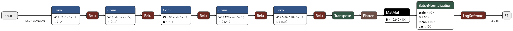
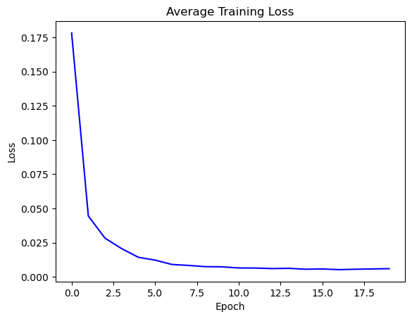
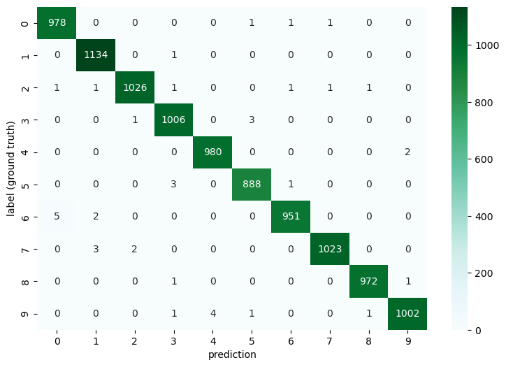
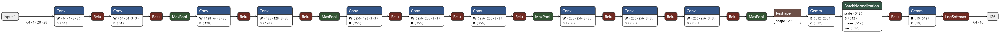
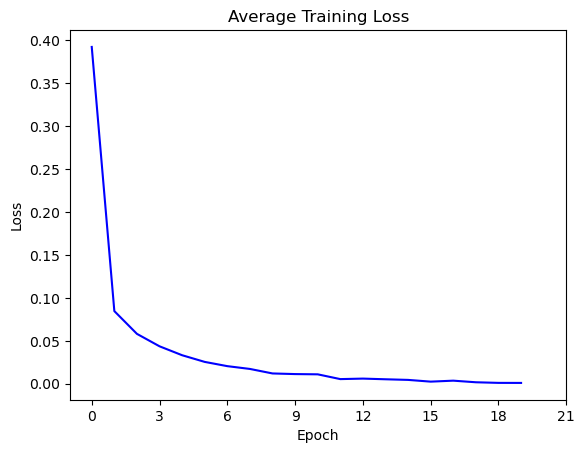
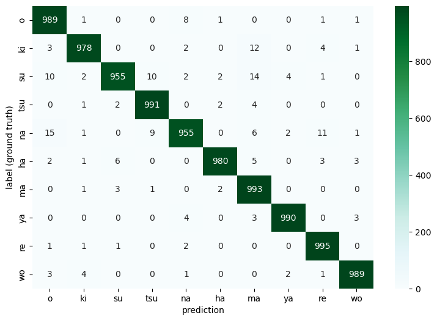
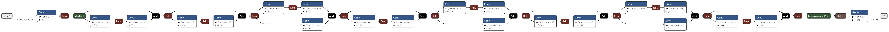
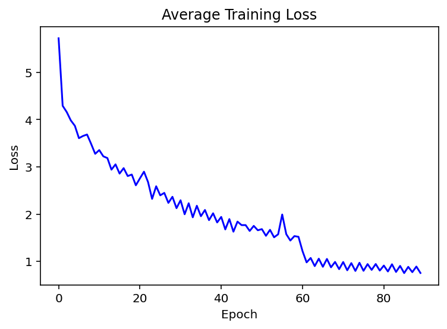
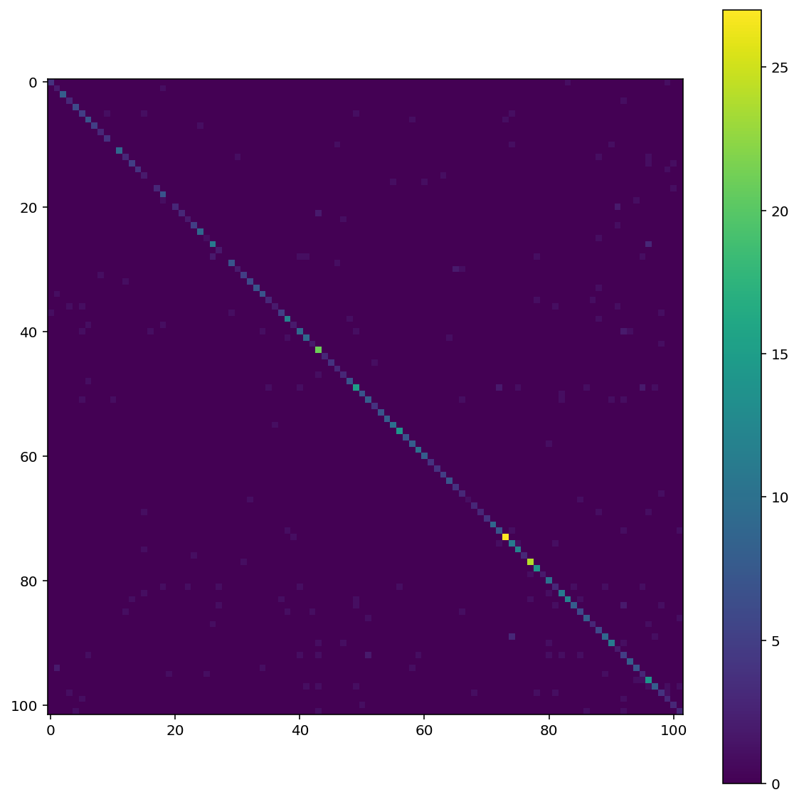

## PyTorch-CNN
<strong>Lab Objective:</strong> 
In this assignment, I build a simple neural network (NN) to do classification
with three datasets (Mnist, Kuzushiji-Mnist [kmnist], Flowers102). 

<strong>Requirements:</strong> 
1. AI framework please use PyTorch.
2. Compare at least 3 activation functions and choose the best for each dataset.
3. Plot your comparison between ground truth and the predicted result.
4. The number of epochs is not restricted, but your model performance and training time will be evaluated.

## MNIST
#### Architecture

    

#### Result

    

#### Training Loss

    

#### Confuse Matrix

    

## Kuzushiji-Mnist
#### Architecture

    

#### Result

    

#### Training Loss

    

#### Confuse Matrix

    

## Flowers102
#### Architecture

    

#### Results

      
      
       
       
     

#### Training Loss

    

#### Confuse Matrix

    

