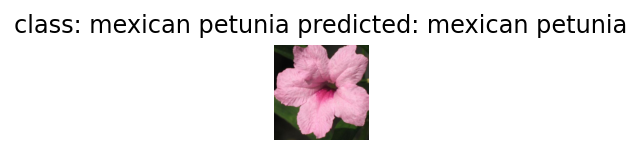

## PyTorch-CNN
In this assignment, I build a simple neural network (NN) to do classification
with three datasets (Mnist, Kuzushiji-Mnist [kmnist], Flowers102).
## MNIST
#### Architecture

    

#### Example

    

#### Training Loss

    

#### Confuse Matrix

    

## Kuzushiji-Mnist
#### Architecture

    

#### Example

    

#### Training Loss

    

#### Confuse Matrix

    

## Flowers102
#### Architecture

    

#### Example
1. foxglove

    

2. water lily

    

3. mexican petunia

    

4. tree poppy

    

5. clematis

    

#### Training Loss

    

#### Confuse Matrix

    

