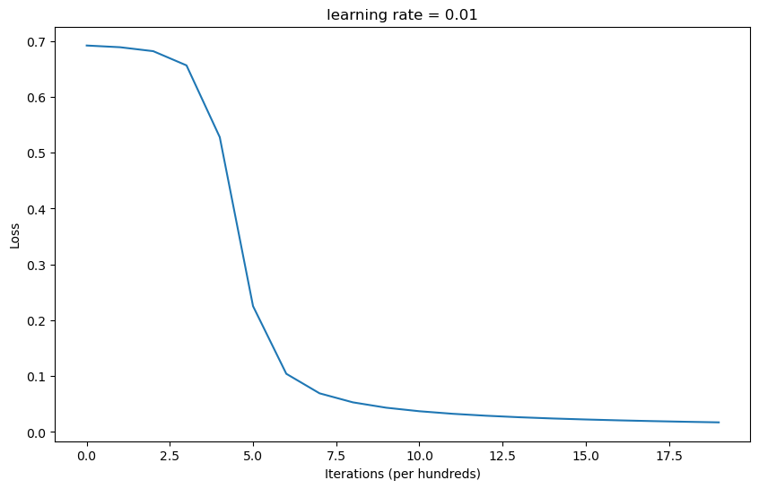
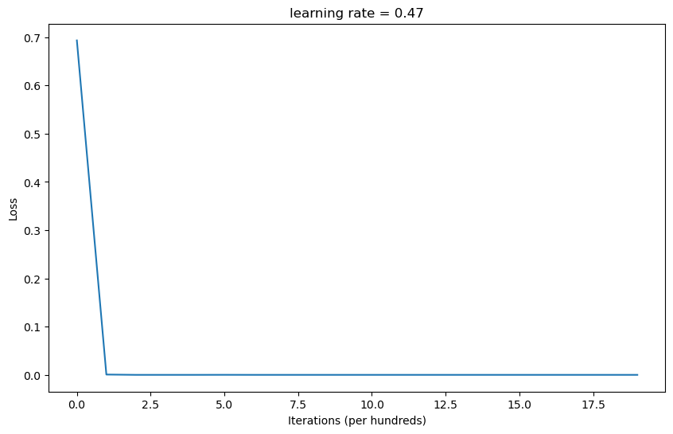
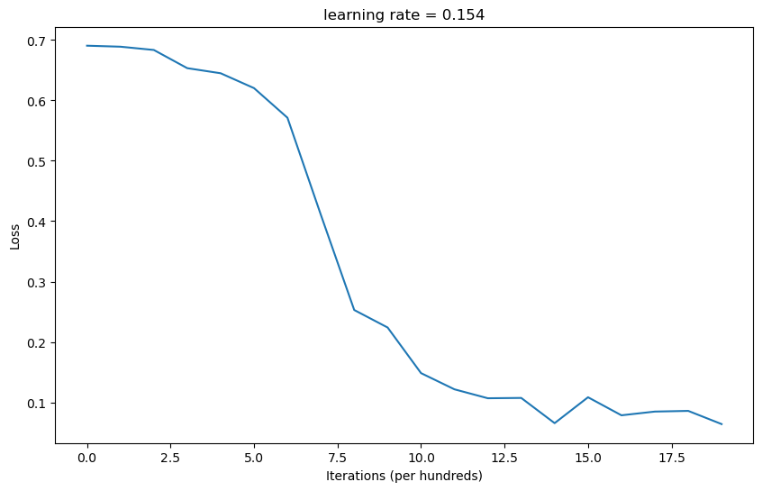

## PyTorch-CNN
<strong>Lab Objective:</strong> 
In this assignment, we need to build a simple neural network (NN) with 3 hidden layers. This NN needs to have both forward pass and back-propagation functionality. 
<strong>Requirements:</strong> 
1. Implement a simple neural network with three hidden layers (with 100 nodes in
hidden layer 1 , 50 nodes in hidden layer 2 and 10 nodes in hidden layer 3).
2. The number of data points generated should > 100, and > 1000 for chessboard.
3. You must use the back-propagation algorithm in this NN and build it from
scratch. Only Numpy and other Python standard libraries are allowed.
4. Plot your comparison between ground truth and the predicted result.
5. The training epochs is not restricted, but model performance will be evaluated.

## Linear
#### Example

    

#### Training Loss

    

## XOR
#### Example

    

#### Training Loss

    

## Chessboard
#### Example

    

#### Training Loss

    

