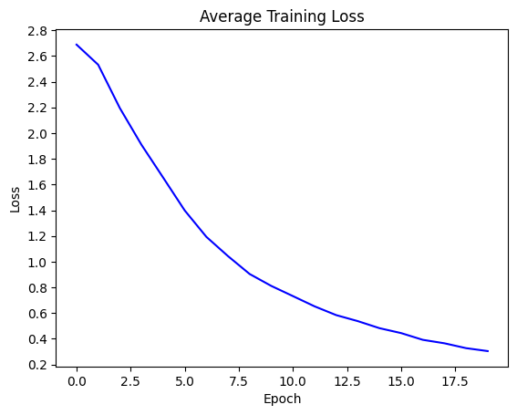
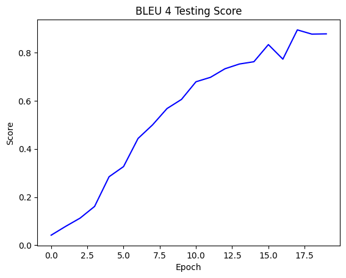
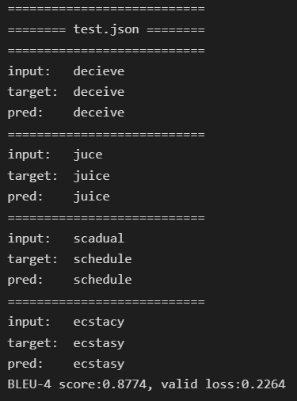
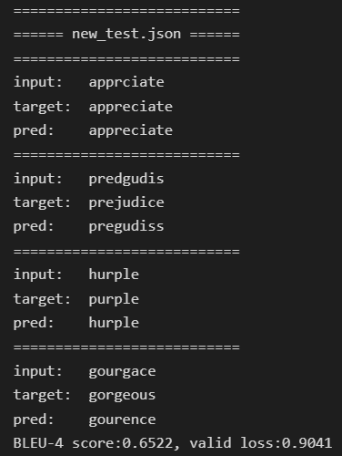

## PyTorch-Seq2Seq
<strong>Lab Objective:</strong> 
In this assignment, you will need to implement a seq2seq LSTM encoder-decoder network with recurrent units for English spelling correction. 

<strong>Requirements:</strong> 
1. Track A. Implement a seq2seq LSTM model by yourself
Track B. Or Use sample code (sample.py)
    * Modify encoder, decoder, and training functions.
    * Implement the evaluation function and the dataloader.
    * Note: This sample code is provided for those who have problem constructing their own project. If you wish to improve the performance, we strongly recommend Track A for you!
2. Plot the CrossEntropy training loss and BLEU-4 testing score curves during
training. And Output the correction results from test.json and new_test.json
3. (Optional parts) Compare performance changes due to different parameters and
model structures and write them into reports (Bonus)

## Training Loss Curve

    

## BLEU-4 Testing Score Curve

    

## Example
1. Dataset - Test

    

2. Dataset - New Test

    

