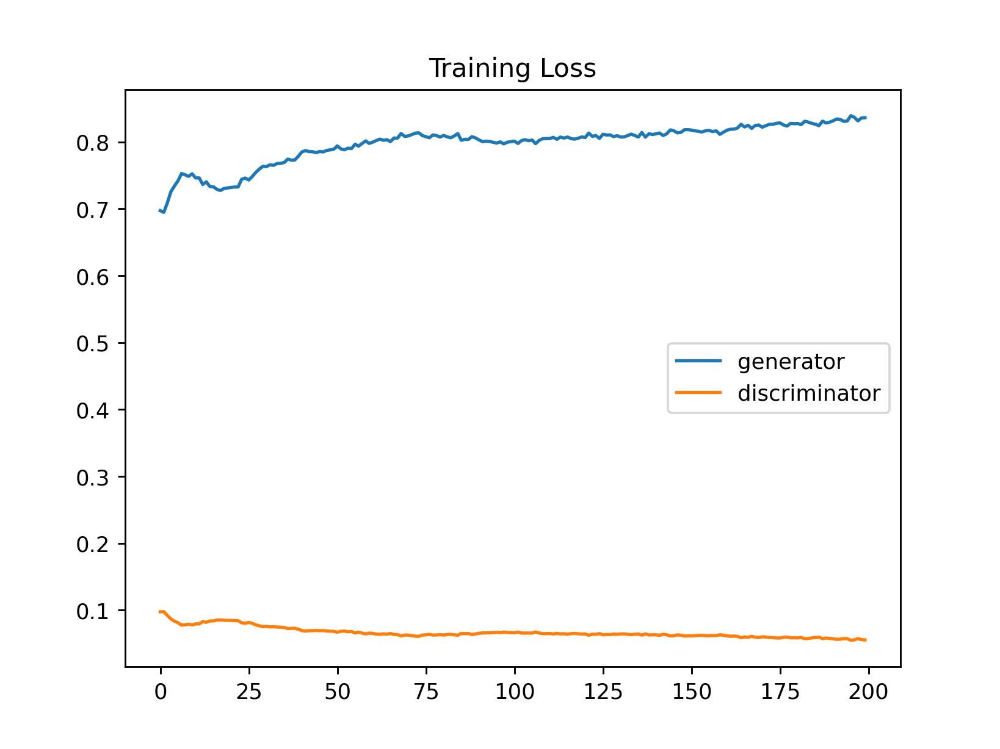
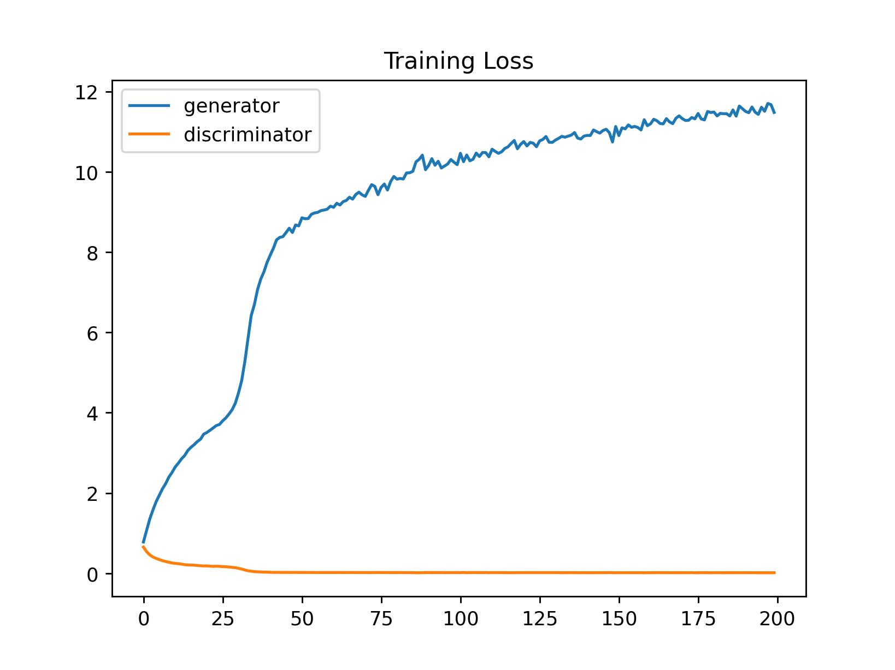
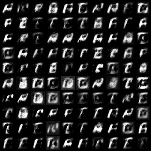
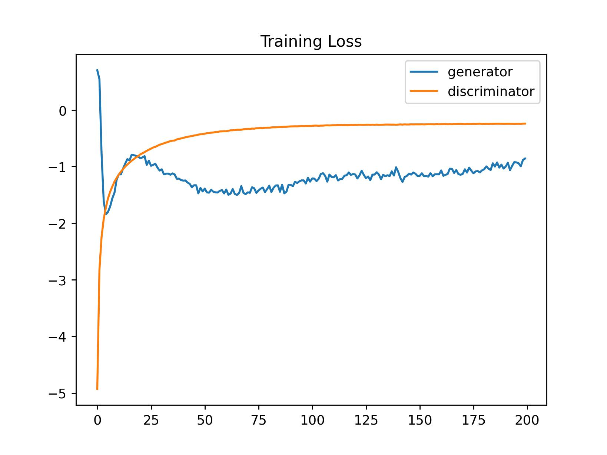

## PyTorch-GAN
<strong>Lab Objective:</strong> 
In this assignment, you will need to implement 3 kinds of GAN with EMNIST dataset. 

<strong>Requirements:</strong> 
1. Make your own dataset to refer to the EMIST dataset. If you can't do it, please refer to the example or use the program in the example to complete the data loader. If you still can't, you can use the MNIST dataset for the assignment, but the score will be very low (60-70).
2. Plot the generator and discriminator training loss during training. And in each GAN you should output a result image with 8x8 generate images or more.
3. Try reading only uppercase "ABDEFGHNQRT" into the data loader as training data (only requires to implement in one of the GANs to demonstrate your ability to customize the data loader)
4. Compare performance changes due to different parameters and model structures and write them into reports.
5. Set “torch.manual_seed(42)” and “torch.backends.cudnn.deterministic = True” in your code for model’s training reproducibility.

## Conditional GAN
#### Example

    

#### Training Loss

    

## Deep Convolutional GAN
#### Example

    

#### Training Loss

    

## Wasserstein GAN GP
#### Example

    

#### Training Loss

    

