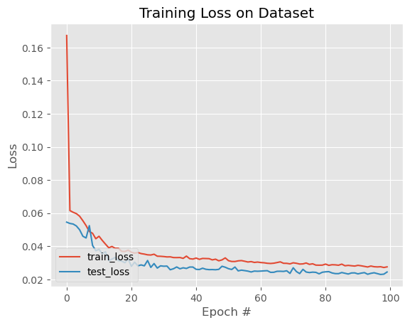
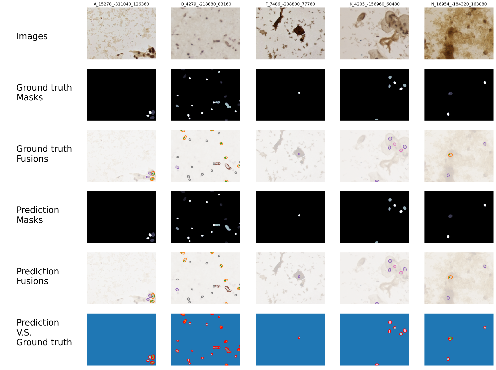

# Semantic Segmentation

**Lab Objective:**

In this assignment, you are required to implement a UNet neural network using the pytorch framework on your own, and use the CCAgT dataset for 5-fold training validation, and testing.

**Requirements:**

1.  you are required to implement your own CCAgT dataset dataloader. If you are unable to complete it, you may refer to and modify others' written ones on the internet (but you must clearly state and cite the website in the report, if not it will be considered as plagiarism).
2.  you need to divide the CCAgT dataset into 3 parts: training, validation, and testing, occupying 7:1:2 respectively. You need to present the final results through several test methods (mAP@[.5:.95:.05], PA, cPA, mPA, Dice, IoU, mIoU) and clearly present 10~20 of the best results through graphical methods using
matplotlib.
3.  you need to implement at least one simple unet neural network as the model for training and present the results. If you have implemented other models or some special data increment improvement methods, they will be an additional bonus..
4.  Set “torch.manual_seed(42)” and “torch.backends.cudnn.deterministic = True” in your code for model’s training reproducibility.
5.  In short, your homework must at least include the following parts:
    - Your own implementation of the CCAgT dataset dataloader.
    - Your own implementation of the unet neural model for semantic segmentation.
    - Model performance evaluation through methods such as (mAP@[.5:.95:.05], PA, cPA, mPA, Dice, IoU, mIoU).
    - Graphical presentation of 10-20 results of semantic segmentation through graphical methods.

## UNet

**Training Loss**

**Results**

